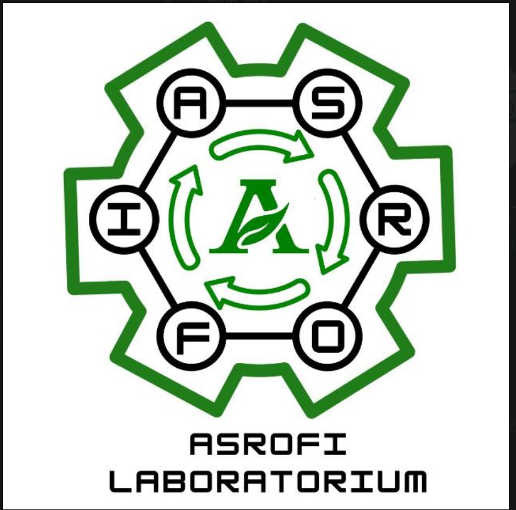

# 🧪 Asrofi Laboratorium

Website resmi **Asrofi Laboratorium** - Laboratorium Riset Material Biokomposit Berkelanjutan, Universitas Jember.



## ✨ Fitur

### 🌐 Website Publik
- **Hero Section** dengan animasi WebGL particle background
- **Gallery Lab** - Galeri foto kegiatan laboratorium
- **Research Projects** - Timeline horizontal proyek riset
- **Team Members** - Kartu tim dengan efek 3D floating
- **Publications** - Daftar publikasi ilmiah
- **Dark/Light Mode** - Toggle tema gelap/terang
- **Multi Bahasa** - Dukungan Bahasa Indonesia & English

### 🔐 Admin Panel
- Dashboard manajemen konten
- CRUD Team Members
- CRUD Research Projects
- CRUD Publications
- Pengaturan website

## 🛠️ Tech Stack

- **Framework**: Next.js 16 (App Router)
- **Language**: TypeScript 5
- **Styling**: Tailwind CSS 4 + shadcn/ui
- **Animation**: Framer Motion
- **Database**: Prisma ORM + SQLite
- **Theme**: next-themes

## 📦 Installation

```bash
# Clone repository
git clone <repository-url>
cd asrofi-lab

# Install dependencies
bun install

# Setup database
bun run db:push

# Seed database (opsional)
bunx tsx prisma/seed.ts

# Start development server
bun run dev
```

## 🚀 Deployment

### Vercel (Recommended)

1. Push code ke GitHub/GitLab
2. Hubungkan repository ke [Vercel](https://vercel.com)
3. Set environment variables:
   ```
   DATABASE_URL="file:./db/custom.db"
   ```
4. Deploy!

### Manual Deployment

```bash
# Build production
bun run build

# Start production server
bun start
```

### Environment Variables

Buat file `.env` di root project:

```env
DATABASE_URL="file:./db/custom.db"
```

## 🔑 Admin Access

Akses admin panel di `/admin/login`:

- **Email**: `admin@asrofi.lab`
- **Password**: `admin123`

> ⚠️ Ganti password default setelah first login!
>
> Jika login gagal, jalankan: `bunx tsx prisma/seed.ts` untuk reset password.

## 📁 Project Structure

```
src/
├── app/
│   ├── api/              # API Routes
│   │   ├── auth/         # Authentication
│   │   ├── team-members/ # Team CRUD
│   │   ├── research-projects/ # Projects CRUD
│   │   ├── publications/ # Publications CRUD
│   │   └── settings/     # Site settings
│   ├── admin/            # Admin Panel
│   └── page.tsx          # Public homepage
├── components/
│   ├── effects/          # Animation components
│   ├── sections/         # Page sections
│   └── ui/               # shadcn/ui components
├── context/
│   ├── ThemeProvider.tsx # Dark/Light mode
│   └── LanguageContext.tsx # ID/EN translations
├── hooks/                # Custom React hooks
└── lib/
    └── db.ts            # Prisma client

prisma/
├── schema.prisma        # Database schema
└── seed.ts              # Seed data

public/
└── logo.png             # Lab logo
```

## 🎨 Kustomisasi

### Mengubah Logo
Ganti file `public/logo.png` dengan logo baru.

### Mengubah Tema Warna
Edit CSS variables di `src/app/globals.css`:
```css
:root {
  --lab-green: #1D7018;      /* Primary green */
  --lab-green-light: #2E8B57; /* Light green */
  --eco-neon: #39FF14;        /* Accent neon */
}
```

### Menambah Bahasa
Edit `src/context/LanguageContext.tsx` untuk menambah terjemahan baru.

## 📱 Responsive Design

Website mendukung semua ukuran layar:
- Desktop (≥1024px)
- Tablet (≥768px)
- Mobile (<768px)

## 🤝 Contributing

1. Fork repository
2. Buat branch fitur (`git checkout -b feature/AmazingFeature`)
3. Commit changes (`git commit -m 'Add AmazingFeature'`)
4. Push ke branch (`git push origin feature/AmazingFeature`)
5. Buka Pull Request

## 📄 License

MIT License - Lihat file [LICENSE](LICENSE) untuk detail.

## 👥 Tim

**Asrofi Laboratorium**
Universitas Jember, Indonesia

---

Built with ❤️ for sustainable materials research
